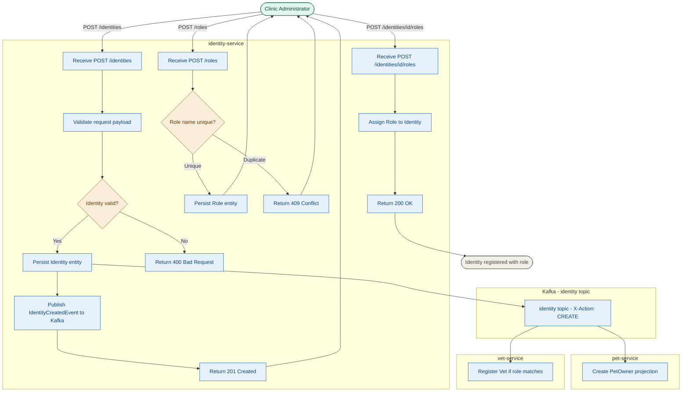
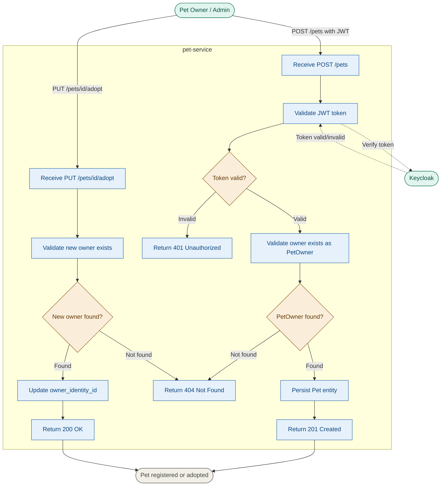
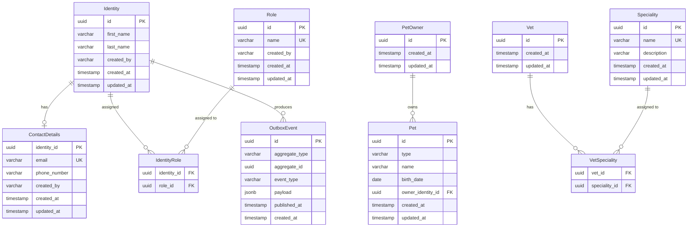
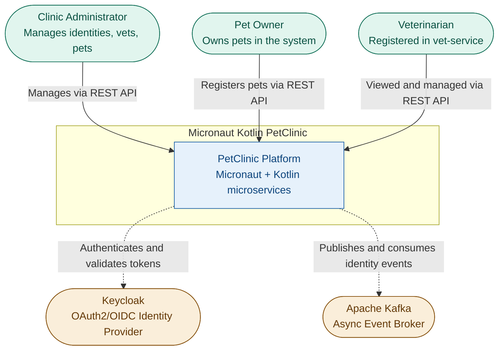
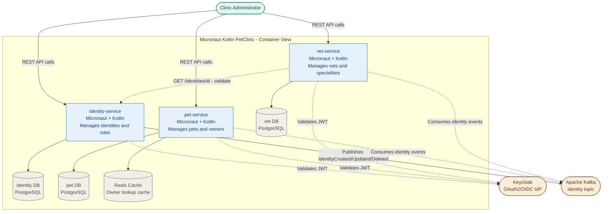
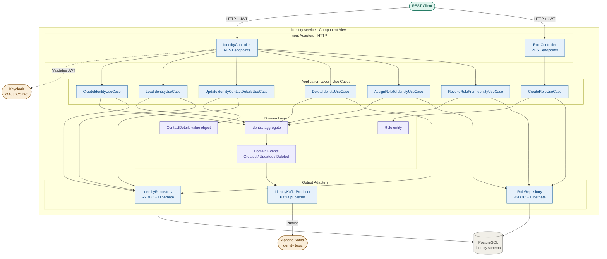

# Micronaut Kotlin PetClinic — Software Design Document

> Version 1.0 | Generated 2026-05-15

---

## 1. Business Model

### 1. System Description

Micronaut Kotlin PetClinic — Clean Architecture is an open-source reference implementation of the classic Spring PetClinic domain, rebuilt as a distributed microservices system using the Micronaut Framework and Kotlin. It demonstrates production-grade engineering practices — clean architecture (ports & adapters), reactive programming, event-driven cross-service communication, and GraalVM native compilation — within a recognisable, bounded domain: veterinary clinic management.

The target audience is software engineers and platform teams who want a concrete, runnable blueprint for building Micronaut-based microservices. The system models three bounded contexts — identity, pet management, and veterinary management — each packaged as an independent Micronaut service with its own PostgreSQL schema. OAuth2/JWT security is delegated entirely to Keycloak, and cross-service business events flow asynchronously over Apache Kafka.

The system is deployed as Docker Compose containers (or compiled GraalVM native images) on developer machines or container platforms. It is not positioned as a commercial SaaS product but as a reference architecture skeleton — designed to be forked, extended, and used as the starting point for real Micronaut microservices projects.

### 2. Added Value and Competitive Advantages

- **Clean architecture enforced structurally**: every service partitions code into `domain/`, `application/ports/`, and `infrastructure/adapters/` packages — making the boundary between business logic and framework wiring impossible to accidentally collapse.
- **Reactive-first persistence with R2DBC**: all database I/O uses Project Reactor + Hibernate Reactive over R2DBC, delivering non-blocking thread usage without retrofitting a blocking ORM.
- **GraalVM native image out of the box**: each service compiles to a native executable via `./gradlew dockerBuildNative`, cutting cold-start time from seconds to milliseconds and reducing container memory footprint significantly compared with JVM-based Spring Boot equivalents.
- **Event-driven cross-service consistency without a saga framework**: identity deletion cascades to pet-service (remove PetOwner) and vet-service (remove Vet) via a single Kafka `identity` topic — no distributed transaction coordinator, no two-phase commit.
- **Keycloak-native RBAC**: role assignment and revocation are modelled as first-class domain use cases in identity-service, not as an afterthought in a shared library, ensuring role state is auditable and consistent.
- **Ports & adapters makes infrastructure swappable**: swapping Kafka for a different broker, or PostgreSQL for a different store, requires only a new `infrastructure/adapters/output/` implementation — the domain and application layers remain untouched.
- **Testcontainers-first integration testing**: the `test-resources` module wires Testcontainers for Kafka, PostgreSQL, Keycloak, and Redis so every service can run a full integration test suite without a running Docker Compose stack.

### 3. Main Features

| Feature | Description |
|---------|-------------|
| Identity management | Create, update, and delete clinic user identities with first name, last name, and contact details (email, phone). |
| Role management | Define named roles and assign/revoke them to identities; roles are first-class domain entities with audit trails. |
| Pet management | Register pets with type (cat, dog, etc.), name, birth date, and an owning identity; support adoption (ownership transfer). |
| Pet owner sync | pet-service maintains a local `PetOwner` projection kept consistent with identity-service via Kafka events — no synchronous HTTP dependency at read time. |
| Vet management | Create and search veterinarians; each vet is linked to an identity from identity-service via a validated HTTP call. |
| Speciality management | Create and assign medical specialities to vets; many-to-many relationship managed through a dedicated use case. |
| OAuth2/JWT security | All REST endpoints are secured; each service validates Keycloak-issued JWT tokens and enforces audience claims per service. |
| Async event streaming | Identity lifecycle events (CREATE/UPDATE/DELETE) are published to the `identity` Kafka topic and consumed by pet-service and vet-service for eventual consistency. |
| Reactive stack | All I/O (HTTP, database, Kafka) is non-blocking using Project Reactor, R2DBC, and Micronaut's reactive HTTP client. |
| GraalVM native compilation | Each service ships as a GraalVM native image, delivering fast startup and low memory usage suitable for ephemeral container environments. |
| Schema migration | Flyway manages per-service database schemas, ensuring reproducible migrations and version-controlled schema history. |
| Redis caching | pet-service uses Redis for caching to reduce repeated database round-trips for frequently accessed pet and owner data. |

### 4. Lean Canvas

```mermaid
graph TB
    subgraph P["1. Problem"]
        P1["- No production-grade Micronaut microservices reference exists"]
        P2["- Teams learning clean architecture lack a concrete multi-service example"]
        P3["- Reactive + GraalVM + Kafka samples are scattered, not integrated"]
    end

    subgraph CS["2. Customer Segments"]
        CS1["- Kotlin/Micronaut engineers"]
        CS2["- Platform teams evaluating Micronaut vs Spring Boot"]
        CS3["- Engineering leads adopting clean architecture practices"]
    end

    subgraph UVP["3. Unique Value Proposition"]
        UVP1["A runnable, test-covered Micronaut microservices skeleton that enforces clean architecture from day one"]
    end

    subgraph SOL["4. Solution"]
        SOL1["- Three bounded-context services (identity, pet, vet)"]
        SOL2["- Ports and adapters enforced by package structure"]
        SOL3["- Kafka-based eventual consistency without a saga framework"]
        SOL4["- GraalVM native images via Gradle"]
    end

    subgraph CH["5. Channels"]
        CH1["- GitHub open-source repository"]
        CH2["- Docker Hub / GHCR images"]
        CH3["- Developer blog and READMEs"]
    end

    subgraph RS["6. Revenue Streams"]
        RS1["- Open source - no direct revenue"]
        RS2["- Consulting and training on Micronaut clean architecture"]
        RS3["- Sponsored development or enterprise forks"]
    end

    subgraph COST["7. Cost Structure"]
        COST1["- Developer time (OSS contribution)"]
        COST2["- CI/CD infrastructure (GitHub Actions)"]
        COST3["- Container registry and hosting costs"]
    end

    subgraph KM["8. Key Metrics"]
        KM1["- GitHub stars and forks"]
        KM2["- CI build pass rate"]
        KM3["- Test coverage across services"]
        KM4["- Native image build success rate"]
    end

    subgraph UA["9. Unfair Advantage"]
        UA1["- Only public Micronaut reference combining clean arch + Kafka + GraalVM + Keycloak"]
        UA2["- Testcontainers test-resources module for turnkey integration tests"]
        UA3["- Ports and adapters enforced structurally, not just by convention"]
    end
```

---

## 2. Use Cases

### 1. Identity and Role Lifecycle Management

**Description** — The Clinic Administrator triggers this use case by registering a new clinic user and assigning them a role. The administrator calls the `POST /identities` endpoint, providing first name, last name, and optional contact details. identity-service creates the `Identity` entity, persists it, and publishes an `IdentityCreatedEvent` to the Kafka `identity` topic. The administrator then calls `POST /roles` to create a named role (if it does not already exist) and `POST /identities/{id}/roles` to assign it. If the identity or role does not exist, the API returns 404. On success, downstream services (pet-service, vet-service) receive the creation event and create their local projections. The outcome is a fully registered clinic user with a role, known to all services.

### 2. Pet Registration and Adoption

**Description** — A Pet Owner (identity in the system) or Clinic Administrator triggers pet registration by calling `POST /pets` on pet-service, providing the pet's type, name, birth date, and the owning identity's ID. pet-service validates that the owner exists locally as a `PetOwner` projection (originally synced from identity-service via Kafka). If the owner is not found, the request is rejected with 404. On success, the `Pet` entity is persisted. The adoption flow (`PUT /pets/{id}/adopt`) transfers ownership to a different `PetOwner` by updating the `owner_identity_id` foreign key. Both flows require a valid JWT token issued by Keycloak.

### 3. Identity Deletion with Cross-Service Cascade

**Description** — This use case is the most critical for data integrity. The Clinic Administrator calls `DELETE /identities/{id}`. identity-service deletes the `Identity` entity and publishes an `IdentityDeletedEvent` to the Kafka `identity` topic with header `X-Action: DELETE`. pet-service consumes this event and deletes the corresponding `PetOwner` and all pets owned by that identity. vet-service consumes the same event and deletes the corresponding `Vet` record. This eventual-consistency cascade ensures no orphaned data remains across services without requiring a distributed transaction or synchronous inter-service HTTP calls at deletion time.

```mermaid
flowchart TD
    Admin([Clinic Administrator])

    subgraph IdentityService["identity-service"]
        A[Receive DELETE /identities/id]
        B[Validate JWT token]
        C{Token valid?}
        D[Delete Identity and ContactDetails]
        E[Publish IdentityDeletedEvent - X-Action: DELETE]
        F[Return 204 No Content]
        G[Return 401 Unauthorized]
    end

    subgraph KafkaTopic["Kafka - identity topic"]
        KT[identity topic - X-Action: DELETE]
    end

    subgraph PetService["pet-service"]
        PS1[Consume IdentityDeletedEvent]
        PS2[Delete PetOwner record]
        PS3[Delete all Pets by owner_identity_id]
    end

    subgraph VetService["vet-service"]
        VS1[Consume IdentityDeletedEvent]
        VS2[Delete Vet record]
    end

    Done([Identity and all related data removed])

    Admin -->|DELETE /identities/id| A
    A --> B
    B --> C
    C -->|Invalid| G
    G --> Admin
    C -->|Valid| D
    D --> E
    E --> F
    F --> Admin
    E --> KT
    KT --> PS1
    KT --> VS1
    PS1 --> PS2
    PS2 --> PS3
    PS3 --> Done
    VS1 --> VS2
    VS2 --> Done

    classDef actor fill:#E1F5EE,stroke:#0F6E56,color:#085041
    classDef step fill:#E6F1FB,stroke:#185FA5,color:#0C447C
    classDef decision fill:#FAEEDA,stroke:#854F0B,color:#633806
    classDef terminal fill:#F1EFE8,stroke:#5F5E5A,color:#444441

    class Admin actor
    class A,B,D,E,F,G,KT,PS1,PS2,PS3,VS1,VS2 step
    class C decision
    class Done terminal
```

---

## 3. Data Model

### 1. Entity Analysis

**`Identity`** — Represents a registered clinic user (owner, vet, or admin) within the identity-service bounded context.

| Field | Type | Description |
|-------|------|-------------|
| id | uuid PK | Primary key |
| first_name | varchar | Given name |
| last_name | varchar | Family name |
| created_by | varchar | Audit: who created this record |
| created_at | timestamp | Record creation timestamp |
| updated_at | timestamp | Last update timestamp |

Relationships: An Identity has zero or one ContactDetails. An Identity has zero or many role assignments via the `identity_role` junction table. An Identity maps to at most one PetOwner in pet-service and at most one Vet in vet-service (cross-service references by UUID, not foreign key).

Design decision: ContactDetails is separated from Identity so that contact information can be added or updated independently, and the PII boundary is clearly isolated for future GDPR compliance.

---

**`ContactDetails`** — Stores email and phone for an Identity; separated to allow optional capture and independent update.

| Field | Type | Description |
|-------|------|-------------|
| identity_id | uuid PK/FK | One-to-one with Identity |
| email | varchar UK | Unique contact email |
| phone_number | varchar | Contact phone number |
| created_by | varchar | Audit: who created this record |
| created_at | timestamp | Record creation timestamp |
| updated_at | timestamp | Last update timestamp |

Relationships: Belongs to exactly one Identity.

---

**`Role`** — A named permission set assignable to identities.

| Field | Type | Description |
|-------|------|-------------|
| id | uuid PK | Primary key |
| name | varchar UK | Unique role name |
| created_by | varchar | Audit: who created this record |
| created_at | timestamp | Record creation timestamp |
| updated_at | timestamp | Last update timestamp |

Relationships: A Role can be assigned to many Identities via `identity_role`.

---

**`IdentityRole`** — Junction table resolving the many-to-many relationship between Identity and Role.

| Field | Type | Description |
|-------|------|-------------|
| identity_id | uuid FK | References Identity |
| role_id | uuid FK | References Role |

Composite primary key on (identity_id, role_id). Design decision: no extra columns — the assignment fact alone is recorded. Audit is captured on the Identity and Role entities respectively.

---

**`PetOwner`** — A local projection in pet-service of the Identity from identity-service, kept consistent via Kafka events. No direct foreign key cross-service; references identity by UUID only.

| Field | Type | Description |
|-------|------|-------------|
| id | uuid PK | Same UUID as the source Identity |
| created_at | timestamp | When projection was created |
| updated_at | timestamp | Last update timestamp |

Design decision: PetOwner deliberately holds only the identity UUID. No name or contact data is replicated, keeping the projection minimal and avoiding stale-data synchronisation problems.

---

**`Pet`** — The core domain entity in pet-service, representing a clinic animal.

| Field | Type | Description |
|-------|------|-------------|
| id | uuid PK | Primary key |
| type | varchar | Pet type (e.g. CAT, DOG) |
| name | varchar | Pet name |
| birth_date | date | Date of birth |
| owner_identity_id | uuid FK | References PetOwner.id |
| created_at | timestamp | Record creation timestamp |
| updated_at | timestamp | Last update timestamp |

Relationships: A Pet belongs to exactly one PetOwner. A PetOwner can own many Pets.

---

**`Vet`** — Represents a veterinarian in vet-service, linked to an Identity by UUID.

| Field | Type | Description |
|-------|------|-------------|
| id | uuid PK | Same UUID as the source Identity |
| created_at | timestamp | Record creation timestamp |
| updated_at | timestamp | Last update timestamp |

Design decision: Vet.id is set to the identity UUID at creation time. vet-service validates the identity exists via a synchronous HTTP call to identity-service before persisting, ensuring referential integrity at write time.

---

**`Speciality`** — A medical speciality that can be assigned to one or many vets.

| Field | Type | Description |
|-------|------|-------------|
| id | uuid PK | Primary key |
| name | varchar UK | Unique speciality name |
| description | varchar | Human-readable description |
| created_at | timestamp | Record creation timestamp |
| updated_at | timestamp | Last update timestamp |

Relationships: A Speciality can be assigned to many Vets via `vet_speciality`.

---

**`VetSpeciality`** — Junction table resolving the many-to-many relationship between Vet and Speciality.

| Field | Type | Description |
|-------|------|-------------|
| vet_id | uuid FK | References Vet |
| speciality_id | uuid FK | References Speciality |

Composite primary key on (vet_id, speciality_id).

---

**`OutboxEvent`** — Transactional outbox record for reliable Kafka publishing in identity-service. In the current implementation, Kafka publishing is synchronous in the adapter; an outbox table provides the foundation for production-grade at-least-once delivery.

| Field | Type | Description |
|-------|------|-------------|
| id | uuid PK | Primary key |
| aggregate_type | varchar | e.g. "Identity" |
| aggregate_id | uuid | ID of the source entity |
| event_type | varchar | e.g. "IDENTITY_CREATED" |
| payload | jsonb | Serialised event payload |
| published_at | timestamp | Null until successfully published |
| created_at | timestamp | Record creation timestamp |

---

### 2. ERD

---

## 4. System Design

### 1. Architecture Overview

Micronaut Kotlin PetClinic decomposes the veterinary clinic domain into three independently deployable microservices, each owning a dedicated PostgreSQL schema: **identity-service** manages clinic users, roles, and contact data; **pet-service** manages pets and their owners; **vet-service** manages veterinarians and medical specialities. This database-per-service partitioning enforces bounded-context isolation at the data layer — no service reads another service's tables directly. Each service is built on the Micronaut Framework with a reactive stack (Project Reactor, R2DBC, Micronaut HTTP Client) and is compiled to a GraalVM native image for fast startup and low memory consumption. Schema evolution is handled per-service by Flyway, ensuring reproducible migrations tied to the service release lifecycle. Redis is used by pet-service as a caching layer to reduce repeated PostgreSQL round-trips for owner lookups.

Cross-service integration follows an event-driven model over Apache Kafka. identity-service is the sole event producer: it publishes `IdentityCreatedEvent`, `IdentityUpdatedEvent`, and `IdentityDeletedEvent` messages to the `identity` Kafka topic, differentiated by the `X-Action` message header. pet-service and vet-service subscribe as independent consumer groups, each maintaining a local read-model projection of the identity data they need. This eliminates runtime synchronous HTTP coupling for the most frequent cross-service consistency operation (identity deletion cascade). vet-service does make a synchronous HTTP call to identity-service at vet creation time to validate that the referenced identity exists — a deliberate trade-off that avoids replicating identity lookup logic at the cost of a point-in-time coupling. Authentication and authorisation are delegated entirely to Keycloak: each service validates Keycloak-issued JWT tokens, enforces audience claims, and gates all REST endpoints behind OAuth2 bearer token validation.

### 2. Microservice Inventory

| Service | Responsibility | Database | Publishes events |
|---------|---------------|----------|-----------------|
| identity-service | Manage identities, contact details, and roles; publish lifecycle events | PostgreSQL (identity schema) | `identity` topic (CREATE, UPDATE, DELETE) |
| pet-service | Manage pets and pet owner projections; consume identity events for consistency | PostgreSQL (pet schema) + Redis cache | None |
| vet-service | Manage vets and specialities; consume identity events; validate identity via HTTP | PostgreSQL (vet schema) | None |
| keycloak | OAuth2/OIDC identity provider; issues and validates JWT tokens | Keycloak internal DB | None |
| kafka | Async event broker; routes identity events to pet-service and vet-service | N/A (broker) | N/A |

### 3. High-Level Architecture Diagram

```mermaid
flowchart TB
    ClinicAdmin([Clinic Administrator])
    PetOwnerUser([Pet Owner])
    VetUser([Veterinarian])

    subgraph AWS["AWS eu-central-1"]
        CF[CloudFront + WAF + Shield]
        R53[Route 53]

        subgraph VPC["VPC - Private Subnets 3 AZs"]
            subgraph EKS["EKS Cluster 1.30"]
                Istio["Istio Service Mesh - mTLS between all pods"]

                subgraph IngressLayer["NGINX Ingress + OAuth2 Proxy"]
                    NGINX[NGINX Ingress Controller]
                end

                subgraph AppServices["Microservices"]
                    IS[identity-service]
                    PS[pet-service]
                    VS[vet-service]
                end

                subgraph PlatformSvcs["Platform Services"]
                    KC[Keycloak IdP]
                end

                subgraph DBLayer["Databases"]
                    ISDB[(identity-service DB)]
                    PSDB[(pet-service DB)]
                    VSDB[(vet-service DB)]
                end

                subgraph CacheLayer["Cache"]
                    RedisNode[(Redis)]
                end

                subgraph ClusterInfra["Cluster Infrastructure"]
                    ESO[External Secrets Operator]
                    HPA[HPA Autoscaler]
                    Flux[Flux CD]
                end

                NetPol["Calico Network Policies - OPA/Gatekeeper - Falco"]
            end

            subgraph ManagedSvcs["AWS Managed Services"]
                MSK[Amazon MSK - Kafka]
                RDS[Amazon RDS PostgreSQL Multi-AZ]
                SM[Secrets Manager]
                ECR[ECR Container Registry]
                CW[CloudWatch]
            end
        end
    end

    subgraph CICDPipeline["CI/CD Pipeline"]
        GHA[GitHub Actions]
        FluxImg[Flux CD ImagePolicy]
    end

    subgraph ObsLayer["Observability"]
        Prom[Prometheus Remote Write]
        OTel[OTel Collector OTLP]
        Fluent[Fluent Bit SIEM]
    end

    Footer["Multi-AZ - EKS nodes across 3 AZs - RDS Multi-AZ standby - 99.9% SLO"]

    ClinicAdmin --> CF
    PetOwnerUser --> CF
    VetUser --> CF
    CF --> R53
    R53 --> NGINX
    NGINX -.->|Verify JWT| KC
    NGINX --> IS
    NGINX --> PS
    NGINX --> VS
    IS --> ISDB
    IS -->|Publish identity events| MSK
    PS --> PSDB
    PS --> RedisNode
    PS -.->|Consume identity events| MSK
    VS --> VSDB
    VS -.->|Consume identity events| MSK
    VS -.->|Validate identity HTTP| IS
    ISDB --> RDS
    PSDB --> RDS
    VSDB --> RDS
    ESO -.-> SM
    GHA -->|Build and push image| ECR
    ECR -.-> FluxImg
    FluxImg -.-> Flux
    Flux -.-> EKS
    EKS -.-> Prom
    EKS -.-> OTel
    EKS -.-> Fluent

    classDef aws fill:#E6F1FB,stroke:#185FA5,color:#0C447C
    classDef svc fill:#E1F5EE,stroke:#0F6E56,color:#085041
    classDef idp fill:#EEEDFE,stroke:#534AB7,color:#3C3489
    classDef managed fill:#FAEEDA,stroke:#854F0B,color:#633806
    classDef db fill:#F1EFE8,stroke:#5F5E5A,color:#444441
    classDef cicd fill:#FAECE7,stroke:#993C1D,color:#712B13
    classDef mon fill:#EEEDFE,stroke:#534AB7,color:#3C3489
    classDef neutral fill:#F1EFE8,stroke:#5F5E5A,color:#444441

    class IS,PS,VS svc
    class KC idp
    class MSK,RDS,SM,ECR,CW managed
    class ISDB,PSDB,VSDB,RedisNode db
    class GHA,FluxImg,Flux cicd
    class Prom,OTel,Fluent mon
    class CF,R53,NGINX,Istio,ESO,HPA,NetPol aws
    class Footer,ClinicAdmin,PetOwnerUser,VetUser neutral
```

---

## 5. C4 Diagrams

### C4 Level 1 — System Context

The System Context diagram shows how the PetClinic platform sits in its environment: the three user roles that interact with it and the two external systems it depends on.

### C4 Level 2 — Container Diagram

The Container diagram shows the three Micronaut services, their databases, and how they communicate with each other and with external systems.

### C4 Level 3 — Component Diagram (identity-service)

The Component diagram drills into identity-service, showing how the clean architecture layers — HTTP input adapters, application use cases, domain, and output adapters — are structured internally.

